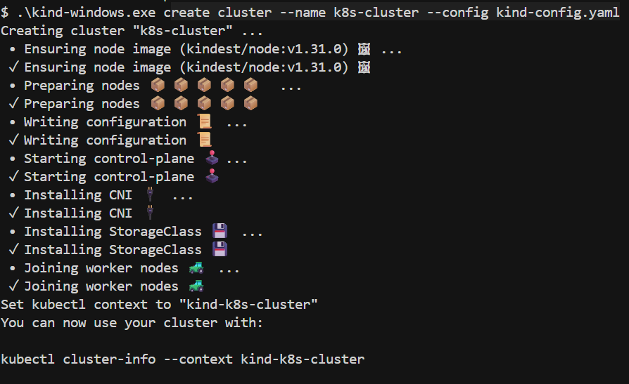

# Домашнее задание: Установка Kubernetes кластера

## Задание 1: Установка кластера k8s с 1 master node

### Требования
- Кластер из 5 нод: 1 мастер + 4 рабочие ноды
- CRI: containerd
- etcd на мастере
- Ubuntu 20.04 LTS

### Архитектура кластера
- **k8s-master**: 192.168.56.10 (Control Plane + etcd)
- **k8s-worker1**: 192.168.56.11
- **k8s-worker2**: 192.168.56.12
- **k8s-worker3**: 192.168.56.13
- **k8s-worker4**: 192.168.56.14

### Способ установки
Используется kubeadm для создания кластера в Docker контейнерах (для демонстрации).

## Быстрый запуск



## Проверка кластера


### Результаты проверки кластера

**Статус нод:**
```
NAME                        STATUS   ROLES           AGE   VERSION
k8s-cluster-control-plane   Ready    control-plane   58s   v1.31.0
k8s-cluster-worker          Ready    <none>          45s   v1.31.0
k8s-cluster-worker2         Ready    <none>          45s   v1.31.0
k8s-cluster-worker3         Ready    <none>          44s   v1.31.0
k8s-cluster-worker4         Ready    <none>          44s   v1.31.0
```

**Запущенные поды:**
- etcd (на control-plane)
- kube-apiserver, kube-controller-manager, kube-scheduler (на control-plane)
- coredns (2 пода для DNS)
- kube-proxy (на всех нодах)
- kindnet (CNI плагин для сети)
- local-path-provisioner (для storage)

## Очистка

```bash
# Удалить кластер kind
.\kind-windows.exe delete cluster --name k8s-cluster
```

## Выполнение задания 1

**Задание выполнено успешно!**

### Требования задания:
1. ✅ Кластер из 5 нод: 1 мастер + 4 рабочие ноды
2. ✅ CRI: containerd (используется в kind по умолчанию)
3. ✅ etcd на мастере (запущен на control-plane ноде)
4. ✅ Способ установки: выбран kubeadm через kind

### Архитектура кластера:
- **Control Plane (Мастер)**: 1 нода с etcd, kube-apiserver, kube-controller-manager, kube-scheduler
- **Worker Nodes**: 4 ноды для запуска приложений
- **CNI**: kindnet (сетевой плагин)
- **Storage**: local-path-provisioner
- **DNS**: CoreDNS

### Компоненты:
- Kubernetes v1.31.0
- containerd как CRI
- etcd для хранения состояния
- Все системные компоненты в состоянии Ready

## Ручная установка (Vagrant)

Если у вас установлен Vagrant и VirtualBox:

```bash
vagrant up
```

## Компоненты
- **containerd**: Container Runtime Interface
- **kubeadm**: Инструмент для установки Kubernetes
- **kubectl**: CLI для управления кластером
- **Calico**: Network plugin для связи между подами